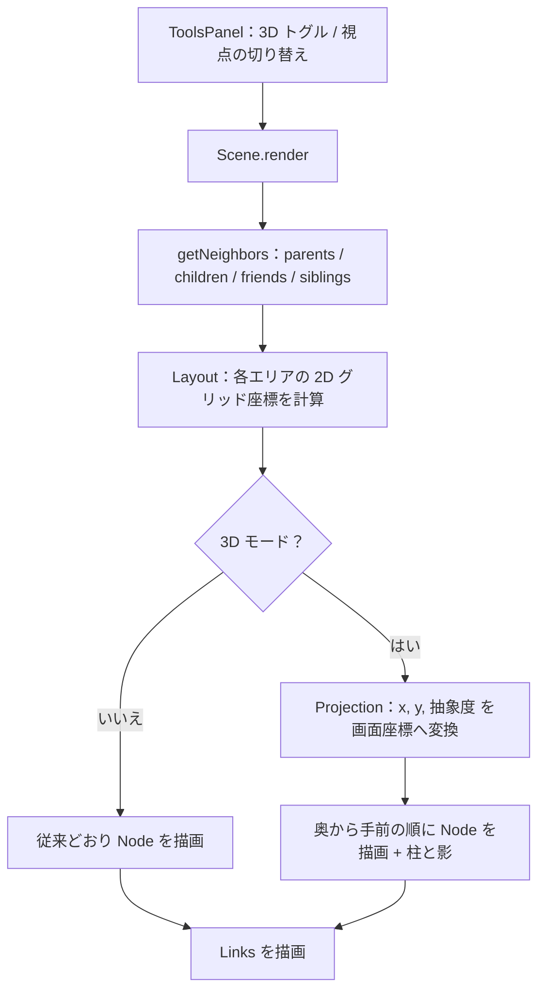

# ExcaliBrain フォーク：3D トグル実装ブリーフ

（本人が別セッションの Claude と議論した内容を 2026-09-20 に引き継いだもの。原文のまま保存。実装の見立て（§5）はソース未検証で、フェーズ 0 の調査結果は `docs/3d-design.md` に別途まとめる。）

このファイルは、ユーザー（飯塚さん）と別セッションの Claude が行った議論を、実装担当の Claude Code に引き継ぐためのものです。Claude Code はその議論を見ていない前提で書いています。

- 対象リポジトリ：`zsviczian/excalibrain` のユーザーによるフォーク（フォーク済み）
- やりたいこと：ExcaliBrain に「3D」ボタンを足し、押すと今の 2D 配置が疑似 3D（高さ = 抽象度）に切り替わるようにする
- 最初にやってほしいこと：コードを書く前に「7. フェーズ 0」の調査をして、結果をユーザーに報告する

---

## 1. 背景

### ユーザーについて

- Obsidian のヘビーユーザーで、ExcaliBrain を日常的に使っている。エンジニア経験あり。
- ExcaliBrain のオントロジー（Dataview フィールドで親・子・フレンドを明示する仕組み）を手で付けて運用してきた。
- ノートごとの「抽象度」をすでに持っていて、ExcaliBrain 上でノードの色分けに使っている（本人談）。
  - **保存形式は未確認。** タグなのか frontmatter のフィールドなのか、何段階なのかを、実装前にユーザーに確認すること（「8. ユーザーに確認すること」参照）。

### ExcaliBrain の現状（前提知識）

中心ノートの周りに、関係の種類ごとに決まった方角へノードを置く 2D ビュー。

```
                [ 行動デザイン ]    [ 読書メモ：習慣の本 ]            北 = Parents
                          \              /
[ if-then プラン ] ── [ 習慣はトリガー固定で続く ] ── [ 意志力で続ける ]
  西 = Left friends              中心                東 = Right friends / Next
                     /           |            \
   [ 朝のルーティン手順 ] [ 歯磨き後に腕立て ] [ 9/20 朝ランの記録 ]    南 = Children
```

位置はすべて「中心ノートから見た相対関係」で決まる。ノート単体の性質（抽象度）は位置に反映されない。

### ユーザーの問題意識

北（親）には性質の違うものが混ざっている。デフォルトの親フィールドに `origin` や `inception` があることからも分かるとおり、北に来るのは次の2種類。

- 上位概念としての親（例：「行動デザイン」。中心ノートより抽象的）
- 由来としての親（例：「読書メモ：習慣の本」。中心ノートより具体的。ただの出どころ）

2D の配置だけでは、この2つは同じ見た目になる。色分けで区別はできているが、ユーザーは「高さ」として立体的に見たい。

---

## 2. これまでの議論の要約と決定事項

| 論点 | 結論 | 理由 |
| --- | --- | --- |
| 本物の 3D（WebGL、ドラッグで自由回転）にするか | しない | ExcaliBrain は Excalidraw という 2D キャンバスの上に作られていて、カメラの概念がない。やるなら作り直しになる |
| 疑似 3D（投影）はできるか | できそう、という見立て | 位置の計算（Layout）と描画（Node / Links）が分かれているので、その間に投影の関数を1枚挟める。**ただし仕様書ベースの見立てで、ソースは未検証** |
| 3D を常用ビューにするか | しない。2D がホームで、3D は切り替え式の「検査モード」 | ExcaliBrain の価値は、同じノートがいつも同じ配置で出てくる安定性にある。常時 3D はそれを壊す |
| フォークか別プラグインか | フォーク（ユーザーが決定、フォーク済み） | 「いつもの画面のまま切り替わる」体験を優先 |
| 回転 | 段階的な回転のみ | 視点を変えるたびに全要素の描き直しになるため、滑らかなドラッグ回転は狙わない |

### 今回のスコープ外（文脈として知っておいてほしいこと）

議論の出発点は Jev（TypeSafe 社の判定専用モデル。テキストを生成せず、Choice / Score / Noul の型付き回答と確率だけを返す）だった。次の2つは別件として保留中で、今回は実装しない。

- リンクに付けるオントロジーのフィールドを Jev の Choice で順位付けしてサジェストする案。ExcaliBrain の既存サジェスターは「フィールド名を先に選び、後からリンクを書く」順番なので、リンク先が分からない時点では判定できない。やるなら「貼った後のリンクに型を付ける」別コマンドになる。
- Jev の Score で抽象度を付ける案。ユーザーはすでに抽象度を持っているので、今回は付け方には踏み込まない。

---

## 3. ゴール

ExcaliBrain のツールパネルに 3D トグルを追加する。

- オフ（デフォルト）：現在の ExcaliBrain とまったく同じ表示
- オン：同じノード・同じリンクのまま、次の座標系で描き直す
  - 地面の左右 = 西 / 東（今の x と同じ）
  - 地面の奥 / 手前 = 北 / 南（今の y が「奥行き」になる）
  - 高さ = そのノートの抽象度（高いほど抽象）

### 図解：3D モードで何が見えるようになるか

横から見た図（左が奥 = 北、右が手前 = 南。縦が抽象度）。

```
抽象度
  L4 ─   ■ 行動デザイン
         ┊
  L3 ─   ┊        ■ 中心 / if-then プラン / 意志力で続ける
         ┊        ┊
  L2 ─   ┊        ┊          ■ 朝のルーティン手順
         ┊        ┊          ┊
  L1 ─ ──●───◇────●──────────●────■────■──────  地面
             └ 読書メモ：習慣の本      └ 歯磨き後に腕立て / 9/20 朝ランの記録
             （北にあるのに低い）

        奥（北 = 親） ─────────────────→ 手前（南 = 子）

  ■ ノード   ┊ 地面までの破線の柱   ● 地面に落ちる影   ◇ 由来の親
```

読み取ってほしいこと：

- 「行動デザイン」は北にあって、一番高い。上位概念としての親。
- 「読書メモ：習慣の本」は同じ北にあるのに、地面にいる。由来としての親。
- 2D では同じ見た目だった2つの親が、高さの違いとして分かれる。これがこの機能の価値。

画面上の見た目（斜め上から見下ろした投影）。箱は常に正面を向いたままで、位置だけが変わる。

```
              ■ 行動デザイン (L4)
              ┊
   ■ if-then ─┊──── ■ 中心 (L3) ──────── ■ 意志力 (L3)
   ┊          ┊     ┊                    ┊
   ┊          ┊     ┊     ◇ 読書メモ (L1・破線枠)
   ┊    ■ 朝のルーティン (L2)             ┊
 ╱─●──────────●─────●────┊───────────────●───────╲   地面（薄い平行四辺形）
╱       ■ 歯磨き (L1)    ●    ■ 9/20 朝ラン (L1)   ╲
```

---

## 4. 投影の仕様（リファレンス実装）

議論の中で作った動くモックで使った投影。1関数で済む。

```js
// gx, gy : 2D レイアウト上の、中心ノートからの相対座標（gy はマイナスが北）
// level  : 抽象度（1 = 最も具体）
// yaw    : 視点の回転角（度）。モックでは -40〜40、初期値 20
function project(gx, gy, level, yaw) {
  const a = (yaw * Math.PI) / 180;
  const rx = gx * Math.cos(a) - gy * Math.sin(a);   // 地面の上で回す
  const ry = gx * Math.sin(a) + gy * Math.cos(a);
  return {
    x: CENTER_X + rx * 0.8,                          // 左右は少しだけ縮める
    y: GROUND_Y + ry * 0.38 - (level - 1) * LEVEL_H, // 奥行きを潰し、抽象度ぶん持ち上げる
    depth: ry,                                       // 描画順（奥から手前）に使う
  };
}
```

補足：

- `0.8`、`0.38`、`LEVEL_H = 78` は幅 680px のモック用に合わせた値。ExcaliBrain の実際のノード寸法や `compactView` / `compactingFactor` に合わせて調整が要る。設定値として外に出すこと。
- 抽象度の段数がユーザーの運用と違う場合に備えて、`(score - min) / (max - min)` で 0〜1 に正規化してから高さに変換する形にしておくと安全。
- Excalidraw はテキストを斜めに歪ませられない。箱は常に正面向き（ビルボード）にする。これは読みやすさの面でも利点。

---

## 5. 実装の見立て（未検証。必ずソースで確認すること）

以下はリポジトリ直下の `EXCALIBRAIN_DETAILED_SPECIFICATION.md` を読んだうえでの理解で、`src/` のコードは確認していない。クラス名やメソッド名は仕様書の記述による。



- `Scene.render()` が中心ノートの隣接ノードを取得し、エリア（親・子・左フレンド・右フレンド・兄弟）ごとに `Layout` を作って描画し、最後に `links.render()` を呼ぶ。
- `Layout.layout(columns)` がエリア内のグリッド位置を決める。エリア内の並びはアルファベット順。
- `Node` は `ea.addText(x, y, label, { box: true, ... })` で箱付きテキストを置き、`box.link` に `[[filePath]]` を入れている。親・子・フレンド用の「ゲート」（小さな円）を `ea.addEllipse` で足している。
- `Link.render()` は `ea.connectObjects(gateA, null, gateB, null, ...)` でゲート同士をつなぐ。
- `ToolsPanel` に検索・フィルター・各種コントロールがある。

### 変更の入れ方の方針

- 上流（zsviczian/excalibrain）の更新を取り込み続けられるよう、変更は局所化する。投影・柱・地面の描画は新規ファイル（例：`src/graph/Projection.ts`）にまとめ、既存コードへのフックは最小限にする。
- 3D オフのときは既存のコードパスをそのまま通す。分岐は1か所に寄せる。

---

## 6. 要件

### 必須

1. **トグル**：ツールパネルに 3D のオン / オフを追加する。オフがデフォルト。
2. **回帰なし**：オフのときの表示と挙動は、変更前と完全に同じであること。
3. **全エリアに適用**：中心、親、子、左右フレンド、前 / 次、兄弟のすべてを投影する。
4. **地面までの柱**：各ノードから地面（最も低いレベルの高さ）へ破線の縦線を引き、地面に小さな影を置く。これがないと「高い位置にある」のか「奥にある」のか区別がつかない。必須扱い。
5. **描画順**：奥のノードから順に描く（Excalidraw は後から追加した要素が上に来る）。手前の箱が奥の箱を隠す向きにそろえる。
6. **既存の操作を壊さない**：ノードのクリックで移動、ホバープレビュー、リンクのラベル表示、フィルター、ピン留めが 3D でも動くこと。
7. **抽象度がないノートの扱い**：フォルダ、タグ、URL、未解決リンク（ゴーストノード）、スコア未付与のノートの高さを決める。案は「設定で指定したデフォルトのレベルに置く」。ユーザーに確認すること。

### あると良い

8. **視点の切り替え**：ヨー角を段階的に変える操作（例：15° 刻みのボタンか、離したときだけ再描画するスライダー）。連続再描画は避け、既存のデバウンスの仕組みに乗せる。
9. **地面の表示**：薄い平行四辺形と、北 / 南 / 西 / 東のラベル。
10. **逆転の強調**：親なのに中心より抽象度が低い、子なのに高い、というノードの枠を破線などで強調する。
11. **設定項目**：抽象度の取得元（フィールド名 or タグの接頭辞）、段数、1段あたりの高さ、奥行きの潰し率、初期ヨー角、柱 / 地面の表示オン / オフ。

### やらないこと

- WebGL / three.js による本物の 3D、ドラッグでの滑らかな回転
- インデックス作成や関係判定（親 / 子 / フレンドの推論）のロジック変更
- Jev など外部 API との連携
- 抽象度を付ける / 計算する機能（すでにある値を読むだけ）

---

## 7. 進め方

### フェーズ 0：調査と報告（コードを書く前に）

次を確認して、結果と実装方針をユーザーに報告する。見立てが外れていた場合は、この文書より実際のコードを優先すること。

- [ ] ノードの最終的な座標は、どのクラスのどのメソッドで決まるか。投影を挟める1か所はどこか。
- [ ] リンクは本当にゲート要素同士の接続か。ノードを動かせばリンクは自動で付いてくるか。
- [ ] **ゲートの向きの問題**：今は「親は上のゲート、子は下のゲート」から線が出る前提のはず。3D では、由来の親（L1）が画面上で中心より下に来ることがある。その場合に線が不自然に回り込まないか。必要なら 3D モードではノード中心同士を結ぶか、投影後の位置関係でゲートを選び直す。
- [ ] 兄弟（siblings）ノードはどこでレイアウトされているか。
- [ ] ToolsPanel のボタンはどう定義されていて、状態はどう設定に保存されているか。
- [ ] ユーザーが今やっている「抽象度の色分け」は、ExcaliBrain のどの機能に乗っているか（タグ別スタイル `tagNodeStyles` か、`primaryTagField` か）。3D の高さは同じ値を読みに行くこと。
- [ ] ノード数が多いとき（親20・子30 程度）の要素数と再描画時間。柱と影でノードあたり 2 要素増える。

### フェーズ 1：固定視点の 3D トグル

必須要件の 1〜7。ヨー角は固定値。

### フェーズ 2：視点の切り替えと仕上げ

要件 8〜11。

### 動作確認用のテストケース

「1. 背景」の 8 ノートの例をテスト用 Vault として作ると、期待どおりか目で確認しやすい。抽象度の書き方はユーザーの実運用に合わせること（下の表の値は仮）。

| ノート | 中心との関係 | 抽象度（仮） |
| --- | --- | --- |
| 習慣はトリガー固定で続く | 中心 | 3 |
| 行動デザイン | 親（上位概念） | 4 |
| 読書メモ：習慣の本 | 親（由来） | 1 |
| if-then プラン | 左フレンド | 3 |
| 意志力で続ける | 右フレンド | 3 |
| 朝のルーティン手順 | 子 | 2 |
| 歯磨き後に腕立て | 子 | 1 |
| 9/20 朝ランの記録 | 子 | 1 |

合格の目安：

- 3D オンで「行動デザイン」が最も高く、「読書メモ：習慣の本」が北側の地面にいる。
- すべてのノードから地面へ柱が伸びている。
- 3D オフに戻すと、変更前とまったく同じ配置になる。
- どのノードをクリックしても、2D のときと同じく中心が切り替わる。

---

## 8. ユーザーに確認すること

実装を始める前に、Claude Code からユーザーに聞いてほしい項目。

1. 抽象度はどこに、どんな形式で保存しているか（タグ / frontmatter / Dataview インラインフィールド、キー名、値の型）。
2. 何段階か。数字が大きいほうが抽象か。
3. 抽象度が付いていないノートは、3D でどの高さに置きたいか。
4. 3D のオン / オフは、Obsidian を再起動しても覚えていてほしいか。
5. 視点の回転は最初から要るか、固定視点でまず試すか。
6. モバイルでも使うか（デスクトップだけなら要素数や再描画の制約が緩む）。

---

## 9. 既知のリスク

- **密なノードでの重なり**：例は 8 ノートなので綺麗に見えるが、隣接ノートが多いと同じ高さの箱が手前と奥で重なる。描画順をそろえても、2D より読みにくくなる場面はある。3D を「検査モード」と位置づけているのはこのため。
- **上流との乖離**：フォークなので、上流の更新でコンフリクトが起きる。変更を新規ファイルに寄せる方針を守ること。
- **見立て違い**：この文書の実装面の記述は仕様書ベース。フェーズ 0 の結果次第で、設計は変えてよい。
